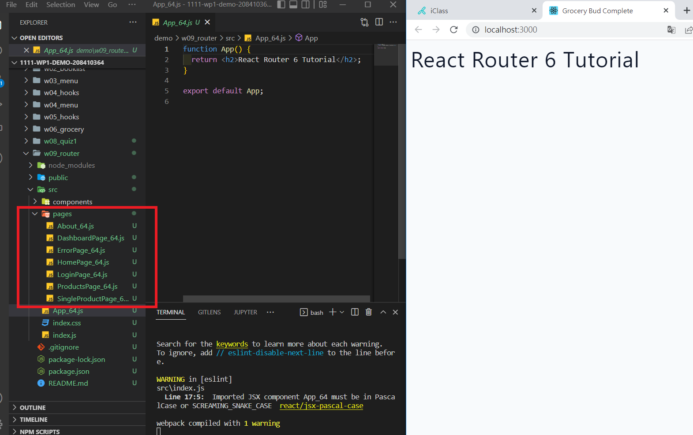
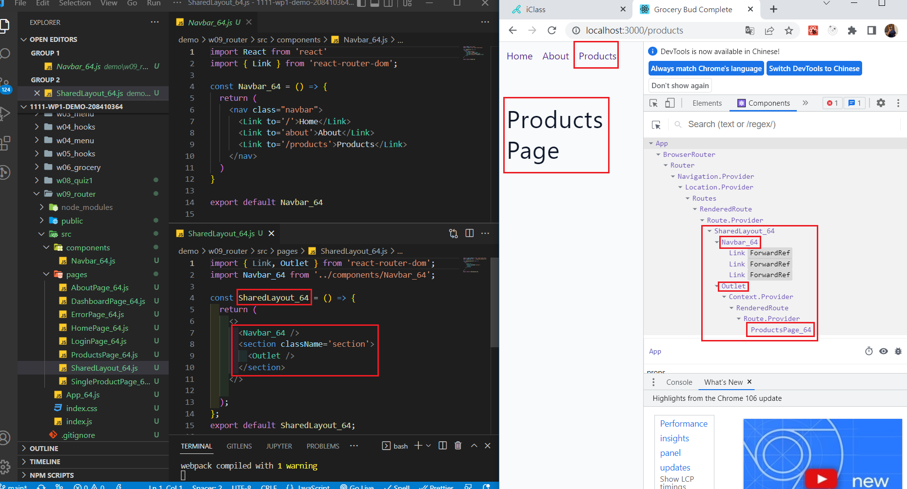
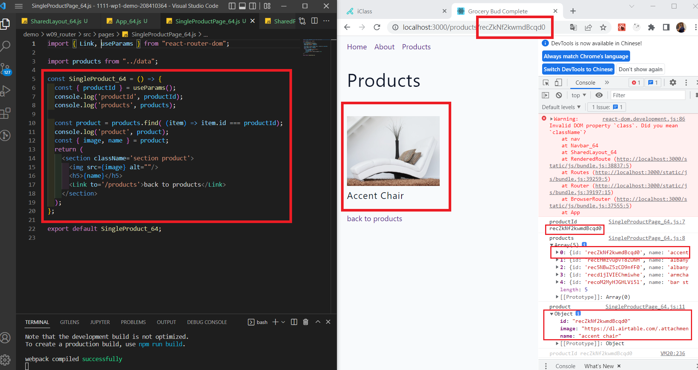
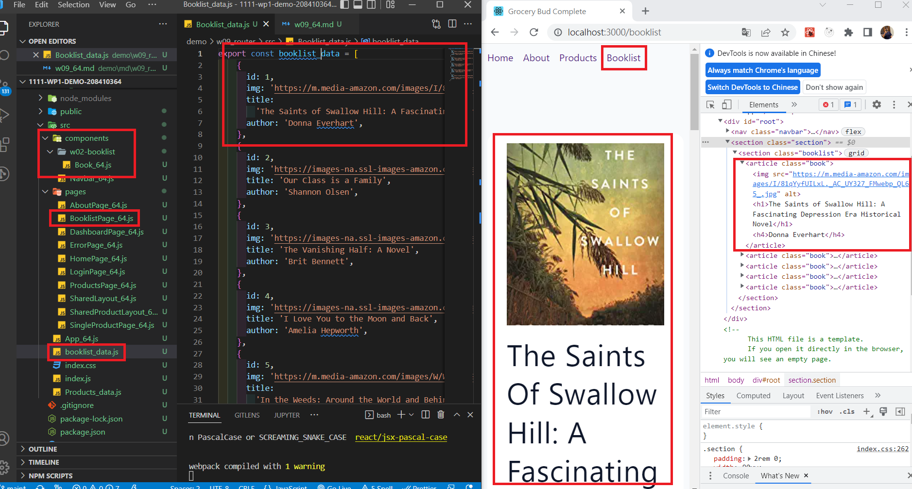

### W09_P1: setup for router tutorial

### W09-P2: <SharedLayout_xx /> with route /products

### W09-P3: find a product using productId using your last digit of ID

### W09-P4: add a route /booklist to show the booklist in w02

### W09-P5: git logs
